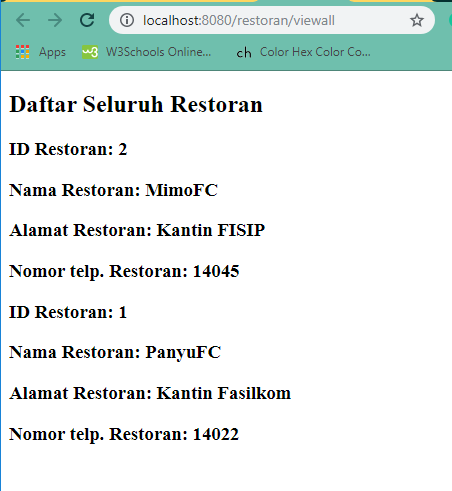

Yasmin Amalia
1706043720
APAP - B

##Tutorial 2
Pertanyaan 1: Terjadi error whitelabel error. Hal ini terjadi karena belum terdapat view atau file html yang dipanggil untuk menampilkan hasil dari program yang sudah dibuat ketika program melakukan mapping di controller.

Pertanyaan 2: Terjadi error whitelabel error karena saat menambahkan restoran tidak ada paramater nomor telepon. Sedangkan di dalam constructor yang kita buat salah satunya adalah nomor telepon dan nomor telepon juga merupakan required parameter yang harus dimasukkan

Pertanyaan 3: Untuk melihat restoran berdasarkan id restoran alamatnya adalah http://localhost:8080/restoran/view?idRestoran=1

Pertanyaan 4: Yang muncul adalah semua restoran yang telah ditambahkan

---
##Tutorial 3
Pertanyaan 1: Fungsi dari method findByRestoranIdRestoran adalah untuk menemukan restoran berdasarkan idRestoran.

Pertanyaan 2: Method addRestoranPage memakai RequestMethod GET, hal ini dikarenakan saat method ini dijalankan method akan mengembalikan halaman yang berisi form penambahan restoran yang mana sistem me-request penambahan data pada halaman ini. Sedangkan pada addRestoranSubmit method menggunakan RequestMethod POST yang mana memungkinkan data yang sudah diisi pada halaman di-pass ke server untuk disimpan menjadi model restoran baru setelah kita klik submit.

Pertanyaan 3: JPA Repository berfungsi untuk persisting objek java ke dalam database, mengakses objek, melakukan define pada data, dan query data.

Pertanyaan 4: 
* Pada RetoranModel
    @OneToMany(mappedBy = "restoran", fetch = FetchType.LAZY, cascade = CascadeType.ALL)
    private List<MenuModel> listMenu;
	
	Restoran memiliki hubungan onetomany terhadap menu yang berarti 1 restoran dapat memiliki banyak menu.
* Pada MenuModel
    @ManyToOne(fetch = FetchType.EAGER, optional = false)
    @JoinColumn(name = "restoranId", referencedColumnName = "idRestoran", nullable = false)
    @OnDelete(action = OnDeleteAction.CASCADE)
    @JsonIgnore
    private RestoranModel restoran;
	
	Menu memiliki hubungan manytoone terhadap restoran.

Pertanyaan 5: 
* FetchType.LAZY
Ketika 2 entitas memiliki hubungan seperti OneToMany, ketika sebuah entitas dipanggil maka entitas lain belum tentu dipanggil kecuali diperlukan. Misalnya entitas menu hanya akan dipanggil ketika sistem menampilkan restoran 1 per 1, tetapi ketika sistem menampilkan semua restoran, menu dari restoran tidak ditampilkan.
* FetchType.EAGER
Ketika 2 entitas memiliki hubungan seperti ManyToOne, ketika sebuah entitas dipanggil makan entitas yang lain pasti ikut dipanggil juga. Misalnya ketika sistem menampilkan menu, maka restoran yang memiliki menu tersebut juga akan ditampilkan.
* CascadeType.ALL
Ketika 2 entitas memiliki hubungan, ketika suatu entitas mengalami perubahan maka entitas lain juga akan berubah.

## Tutorial 5
Pertanyaan 1 :

Pertanyaan 2 :

Pertanyaan 3 : th:include menambahkan konten dari specified fragment pada host tag (kecuali tag fragment) sedangkan th:replacement mengganti host tag dengan konten milik fragment (termasuk tag fragment)

Pertanyaan 4 : 
