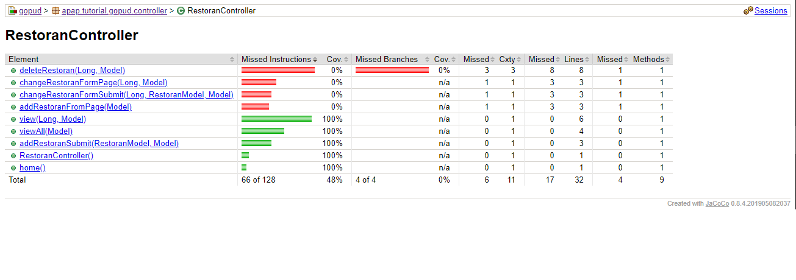

Yasmin Amalia
1706043720
APAP - B

##Tutorial 2
Pertanyaan 1: Terjadi error whitelabel error. Hal ini terjadi karena belum terdapat view atau file html yang dipanggil untuk menampilkan hasil dari program yang sudah dibuat ketika program melakukan mapping di controller.

Pertanyaan 2: Terjadi error whitelabel error karena saat menambahkan restoran tidak ada paramater nomor telepon. Sedangkan di dalam constructor yang kita buat salah satunya adalah nomor telepon dan nomor telepon juga merupakan required parameter yang harus dimasukkan

Pertanyaan 3: Untuk melihat restoran berdasarkan id restoran alamatnya adalah http://localhost:8080/restoran/view?idRestoran=1

Pertanyaan 4: Yang muncul adalah semua restoran yang telah ditambahkan

---
##Tutorial 3
Pertanyaan 1: Fungsi dari method findByRestoranIdRestoran adalah untuk menemukan restoran berdasarkan idRestoran.

Pertanyaan 2: Method addRestoranPage memakai RequestMethod GET, hal ini dikarenakan saat method ini dijalankan method akan mengembalikan halaman yang berisi form penambahan restoran yang mana sistem me-request penambahan data pada halaman ini. Sedangkan pada addRestoranSubmit method menggunakan RequestMethod POST yang mana memungkinkan data yang sudah diisi pada halaman di-pass ke server untuk disimpan menjadi model restoran baru setelah kita klik submit.

Pertanyaan 3: JPA Repository berfungsi untuk persisting objek java ke dalam database, mengakses objek, melakukan define pada data, dan query data.

Pertanyaan 4: 
* Pada RetoranModel
    @OneToMany(mappedBy = "restoran", fetch = FetchType.LAZY, cascade = CascadeType.ALL)
    private List<MenuModel> listMenu;
	
	Restoran memiliki hubungan onetomany terhadap menu yang berarti 1 restoran dapat memiliki banyak menu.
* Pada MenuModel
    @ManyToOne(fetch = FetchType.EAGER, optional = false)
    @JoinColumn(name = "restoranId", referencedColumnName = "idRestoran", nullable = false)
    @OnDelete(action = OnDeleteAction.CASCADE)
    @JsonIgnore
    private RestoranModel restoran;
	
	Menu memiliki hubungan manytoone terhadap restoran.

Pertanyaan 5: 
* FetchType.LAZY
Ketika 2 entitas memiliki hubungan seperti OneToMany, ketika sebuah entitas dipanggil maka entitas lain belum tentu dipanggil kecuali diperlukan. Misalnya entitas menu hanya akan dipanggil ketika sistem menampilkan restoran 1 per 1, tetapi ketika sistem menampilkan semua restoran, menu dari restoran tidak ditampilkan.
* FetchType.EAGER
Ketika 2 entitas memiliki hubungan seperti ManyToOne, ketika sebuah entitas dipanggil makan entitas yang lain pasti ikut dipanggil juga. Misalnya ketika sistem menampilkan menu, maka restoran yang memiliki menu tersebut juga akan ditampilkan.
* CascadeType.ALL
Ketika 2 entitas memiliki hubungan, ketika suatu entitas mengalami perubahan maka entitas lain juga akan berubah.

## Tutorial 4
Pertanyaan 1 :
* Saya belajar mengenai bagaimana membuat fragment pada thymeleaf menjadi dinamis dengan melakukan reuse kode.
* Tahapan: Pertama saya mendefinisikan variabel 'title' pada navbar di fragment.html yang mana nantinya variabel ini akan di-replace sesuai dengan title yang saya tulis di navbar pada body di tiap-tiap html.

Pertanyaan 2 :
* Saya belajar mengenai cara menggunakan method POST dengan params, menambahkan row pada form menu, dan menghapus row pada form menu.
* Tahapan: Pertama saya mengubah sedikit method add menu. Lalu saya membuat method addRow dan removeRow. Kemudian saya mengubah view form add menu di html agar dapat menambah dan menghapus row sesuai index.

Pertanyaan 3 : th:include menambahkan konten dari specified fragment pada host tag (kecuali tag fragment) sedangkan th:replacement mengganti host tag dengan konten milik fragment (termasuk tag fragment)

Pertanyaan 4 : th:object digunakan di dalam tag form. th:object akan mendefinisikan variabel yang akan digunakan untuk memanggil objek ke dalam form yang kita buat.

## Tutorial 5
Pertanyaan 1 : 
* Given: line 113-114. Pada baris 113 dilakukan inisiasi model restoran dan 114 dilakukan pengembalian data yang telah kita buat tadi. 
* When: line 116-120. Pada baris-baris tersebut diberikan kondisi seperti apa yang akan dilakukan testing
* Then: line 122. Pada baris ini dilakukan verifikasi atas hasil yang diharapkan dari testing kondisi pada baris 116-120

Pertanyaan 2 : Line coverage hanya meng-cover statement yang bernilai true dan tidak dapat meng-cover logic statement. Selain itu line-coverage menghitung berapa baris kode yang tercover oleh test. Sedangkan logic coverage mengecek apakah semua fungsionalitas dari kode sudah tercover oleh test yang kita buat.

Pertanyaan 3 : Keadaan ideal bersifat relatif, misalnya untuk TDD yang ideal adalah membuat test terlebih dahulu baru membuat kode yang sesuai dengan tes yang sudah dibuat. Akan tetapi sebenarnya kita dapat membuat kode terlebih dahulu. Risiko yang biasanya terjadi adalah ada fungsionalitas yang mungkin terlewat dalam pembuatan program.

Pertanyaan 4 : Main class spring tidak diikutsertakan dalam perhitungan coverage karena pada tutorial ini hanya akan dilakukan test pada service dan controller, bukan pada keseluruhan aplikasi. Dalam melakukan coverage analysis, kita hanya fokus terhadap class yang akan di-cover oleh unit test. Contohnya pada tutorial ini adalah class controller dan services. Jika sebuah class tidak di-cover dengan unit test, maka perlu untuk dilakukan exclude pada class yang tidak related tersebut.

Before & After Test View
sebelum 
sesudah 

## Tutorial 6
Pertanyaan 1 :
* Postman adalah sebuah aplikasi (berupa plugin) untuk browser chrome sebagai REST Client yang digunakan untuk uji coba REST API yang telah kita buat.
* Postman merupakan tool wajib bagi para API developer. Fungsi utama dari Postman adalah sebagai GUI API caller. Selain itu Postman juga berfungsi untuk sharing collection API for documentation, testing API, realtime collaboration team, monitoring API, dan integration.
* Postman pertama kali muncul dalam bentuk add on Chrome, akan tetapi sekarang sudah menjadi aplikasi native.

Pertanyaan 2 : Anotasi @JsonIgnoreProperties dapat digunakan untuk menekan serialisasi properti (selama serialisasi), atau mengabaikan pemrosesan properti JSON yang dibaca (saat deserialisasi)

Pertanyaan 3 : ResponseEntity mewakili seluruh respons HTTP (kode status, header, body). Sehingga kita dapat menggunakannya untuk konfigurasi response HTTP sepenuhnya.

##Tutorial 7
Pertanyaan 1 :
* Otentikasi menentukan apakah seorang person adalah user atau bukan untuk dapat mengakses sistem. Sedangkan otorisasi menentukan permission apa yang dimiliki oleh user dalam mengakses sebuah resource di dalam sistem.
* Implementasi otentikasi dilakukan ketika user melakukan login. Sistem akan menentukan apakah person adalah user dengan method configAuthentication di WebSecurityConfig.java. Autentikasi juga ditentukan menggunakan interface UserDetailsService milik spring security. Sistem juga akan memvalidasi apakah data person yang dimasukkan ketika login sama dengan data yang dimiliki oleh sistem menggunakan method loadUserByUsername.
* Implementasi otorisasi diilakukan setelah user melakukan login dan mendapatkan user role. Sistem akan menentukan resource apa saja di dalam sistem yang dimiliki oleh user tersebut. Pada WebSecurityConfig.java method configure akan menentukan otorisasi apa yang dimiliki oleh user berdasarkan role-nya. Misalnya hanya user dengan role admin yan dapat melakukan penambahan user, selain role tersebut tidak boleh.

Pertanyaan 2 : BCryptPasswordEncoder adalah sebuah interface yang disediakan oleh spring security untuk membuat encoding pada password menggunakan metode slow hashing algorithm. Hal ini bertujuan untuk "menyembunyikan" password pada database, karena password tidak boleh ditampilkan secara eksplisit. Selain itu interface ini juga dapat digunakan untuk melakukan password comparison.

Pertanyaan 3 :
* Universally Unique Identifier (UUID) adalah sebuah 128 bit long value yang unik dan terdiri dari hex digits dengan 4 char untuk setiap digit serta 4 "-" simbol yang dapat digunakan untuk berbagai keperluan. Total character UUID adalah 36.
* UUID digunakan di UserModel.java untuk menghasilkan id user yang unik.

Pertanyaan 4 : Class UserDetailsServiceImpl.java merupakan implementasi dari interface UserDetailsService yang dimiliki oleh spring security. Kelas ini berbeda dengan UserService atau RoleService yabg merupakan implementasi dari interface aplikasi ini sendiri. Kita memerlukan class tersebut untuk menjalankan proses autentikasi. Salah satu methodnya yakni loadUserByUsername akan mencari tahu apakah person yang melakukan login merupakan user sistem atau bukan.

##Tutorial 8
Latihan 1 : Pada latihan 1 saya menambahkan condition di mana code tersebut mengecek apabila item belum pernah diklik maka checkbox tidak akan muncul dan apabila sudah diklik maka checkbox akan muncul di bagian my favorites
```checked ? <input type="checkbox" checked={checked} onChange={handleChange} /> : null```

Latihan 2 : Untuk latihan 2 saya membuat dua handleItem berbeda. Satu untuk menu dan satu untuk favorites. Untuk menu, saya membuat kondisinya hanya bisa push item (menambahkan) saja. Sedangkan untuk favorites saya membuat kondisinya hanya bisa untuk menghapus saja.
*Menu :
``` handleItemMenu = item => {
    const newItems = [...this.state.favItems];
    const newItem = {...item};
    newItems.push(newItem);
    // schedule setState to update state with new favItems
    this.setState({favItems: newItems});
  };```
*Favorites :
```  handleItemFav = item => {
      const newItems = [...this.state.favItems];
      const newItem = {...item};
      // find index of item with id
      const targetInd = newItems.findIndex(it => it.id === newItem.id);
      newItems.splice(targetInd, 1);
      // schedule setState to update state with new favItems
      this.setState({favItems: newItems});
  }```

Latihan 3 : Saya menambahkan visibility pada state yang mana visibility tersebut menunjukkan apakah favItems terlihat atau tidak. Visibility dipanggil pada toggleFavorite. Ketika checkbox Show My Favorites diklik maka toggleFavorite dijalankan. toggleFavorite akan membuat visibility akan berubah menjadi false atau true tergantung dari visibility state sebelumnya. Jika visibility true maka daftar favorites akan terlihat, sedangkan jika visibility false maka favorites akan disembunyikan.
```state = {
    favItems: [],
      visibility: true
  };```
 
 ```toggleFavorite = ( )=> {this.setState((prevState)=>({visibility: !prevState.visibility}));}```
 
 ```<input type="checkbox" onClick={this.toggleFavorite}/>Show My Favorites```
 
```<div className="col-sm">
	  {!this.state.visibility &&
	  <List
		  title="My Favorites"
		  items={favItems}
		  onItemClick={this.handleItemFav}
	  />
	  } </div>```

Latihan 4 : Untuk latihan 4 saya membuat components baru bernama EmptyState. Isi dari components ini adalah kalimat yang menunjukkan bahwa belum terdapat favorit ketika list favorit kosong. Component ini dipanggil di component List. Pada component List, ketika panjang list = 0 maka List akan mengembalikan isi dari EmptyState.
*EmptyState.js
```import React from "react";

export default function EmptyState(props) {
    return(
        <>
            <h3 style={styles.heading}>Belum ada item yang dipilih</h3>
            <h4>Klik salah satu item di daftar Menu</h4>
        </>
    );
}
            const styles = {
                heading: {
                fontFamily: "courier new"
            }
            };```
*List.js
```{items.length === 0 ? <EmptyState/> :
		<div className="list-group">{}
			{items.map(item => (
				<Item key={item.id} item={item} onChange={onItemClick}/>
			))}
		</div>
   }```